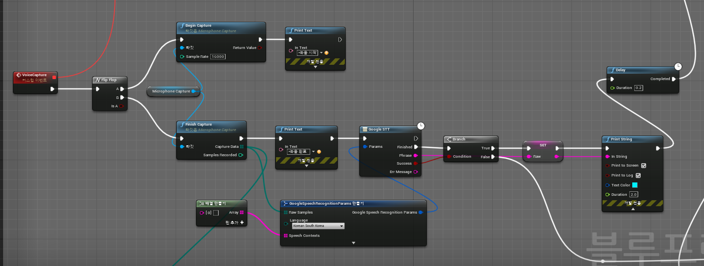
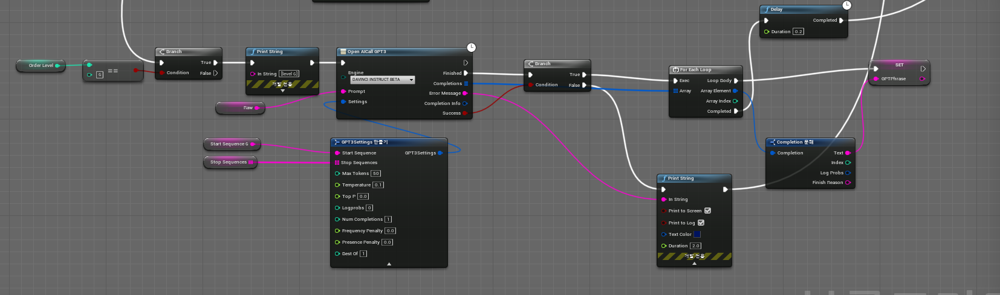
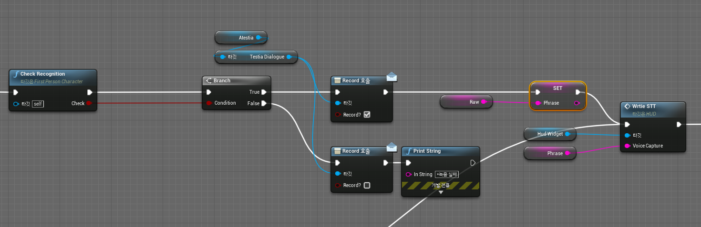
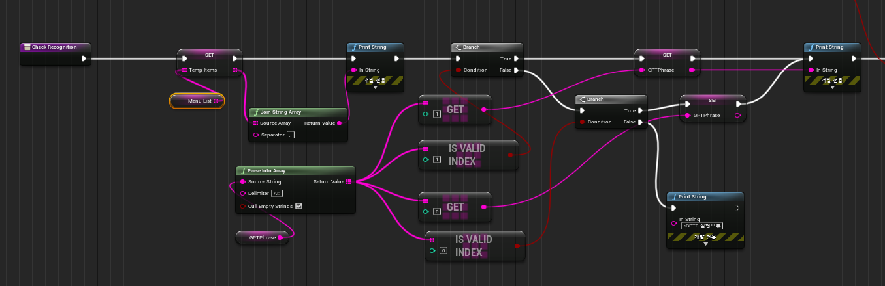

## 시스템 구조 및 역할

## 상세 설계( 기능 구현 )
### 사용자 음성인식(캡쳐)
voiceCapture Event: 사용자 음성인식 및 OpenAI GPT3를 통해 원하는 데이터로 처리 후, checkRecognition 함수 호출하여 사용자 데이터를 확인한다 .
1. 사용자가 녹음 버튼을 누르면 voice capture를 시작하고 다시 누르면 voice capture를 중지하게 한다.   사용자 음성 인식 후, Google STT 함수로 사용자의 음성을 텍스트화 한다.

2. GPT3 settings 노드에서 대본 script(=start sequence) 및 stop sequence를 설정하고, <strong>Open AICall GPT3 함수로 GPT를 실행</strong>하여 사용자 데이터를 처리한다. 
GPT3의 한번에 사용 가능한 토큰량의 한계가 있는 이유로, 주문 프로세스(주문 단계)를 나눠서 GPT3 sequence(=scripts)를 작성한다.  

3. checkRecognition 이벤트에서 처리 및 확인된 사용자 주문 정보를 UI에 띄우는 함수를 호출한다.

### 처리된 음성데이터 확인
checkRecognition Event: 사용자가 주문 프로세스에 따른 정확한 대답을 했는지 성공/실패 반환
1. GPT3에서 처리된 text(=사용자 주문 메뉴)에서 불필요한 값을 정리한다.  
"." , "AI:" , "\n" 및 쓰레기 값을 제거하여 필요한 데이터만 가져온다.  
(ex) AI: Im robot. -> Im robot

2. 사용자 주문 메뉴가 기존 메뉴에 있고 상황에 맞는 정확한 대답인지, 잘못된 대답인지 확인한다.   - 잘못된 대답일 경우 false를 반환하여 다시 음성인식을 시도를 요청한다.   - 정확한 대답일 경우 경우 UE 변수에 사용자 주문 데이터를 저장 후, true를 반환하여 다음 프로세스(주문단계)로 넘어가는 것은 허용 한다.

## 데모 시연

## 참고 사항
1. 개발자

    |이름|역할|
    |------|---|
    |이민하|일랑일랑홀랑훌롱|
    |임혜진|어저고저저고|

2. 블루프린트 실행 링크
      * [어떤기능A](http://www.naver.com)
      * [어떤기능B](http://www.naver.com)
      * [어떤기능C](http://www.naver.com)
